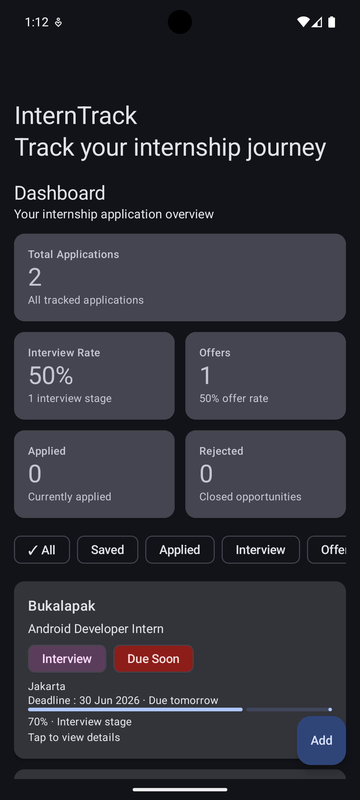
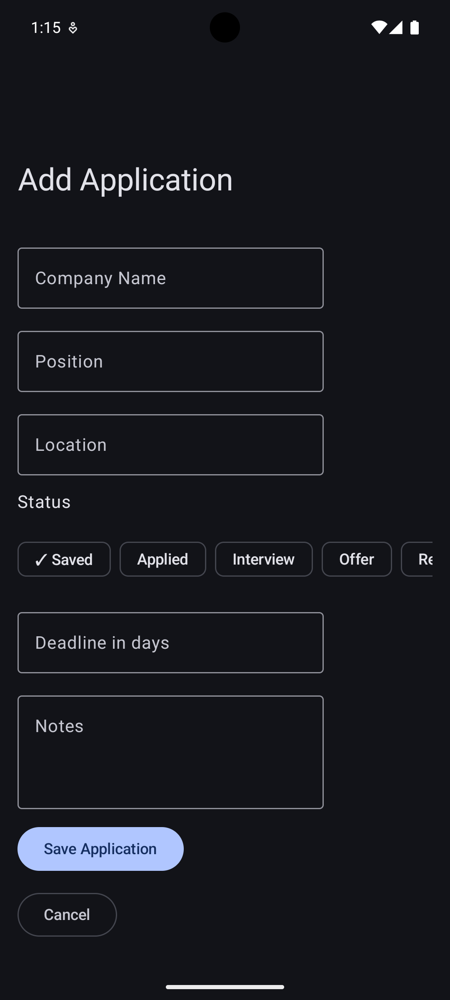
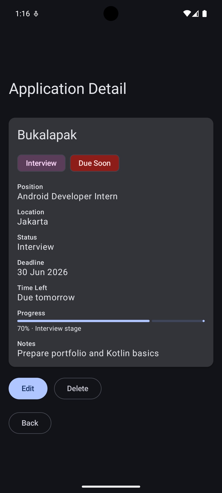

# InternTrack

InternTrack is a Kotlin Android application that helps students track internship applications, recruitment status, deadlines, and application progress.

## Overview

InternTrack was built as a one-week Kotlin Android portfolio project. The app helps students and early-career developers organize their internship applications, monitor deadlines, and understand their application progress through a simple dashboard.

## Features

- Add internship applications
- Edit existing applications
- Delete applications with confirmation dialog
- View application details
- Track application status
- Filter applications by status
- Dashboard summary
- Interview rate calculation
- Offer rate calculation
- Deadline tracking
- Due soon indicator
- Local data persistence

## Tech Stack

- Kotlin
- Jetpack Compose
- Material 3
- Room Database
- Coroutines
- Flow
- StateFlow
- ViewModel
- Navigation Compose
- MVVM Architecture

## Architecture

The app follows a simple MVVM architecture:

```text
UI Layer
↓
ViewModel
↓
Repository
↓
Room Database
```

## Main Screens

- Dashboard and application list
- Add application screen
- Application detail screen
- Edit application screen

## Screenshots

### Dashboard



### Add Application



### Application Detail



## What I Learned

- Building native Android UI using Jetpack Compose
- Managing UI state with StateFlow
- Persisting local data using Room Database
- Structuring an Android app with MVVM
- Implementing CRUD operations
- Creating dashboard analytics from local data
- Handling navigation between Compose screens

## Future Improvements

- Add DatePicker for deadline selection
- Add search by company or position
- Add notification reminders
- Add export to CSV
- Add dark mode polish
- Add UI tests
